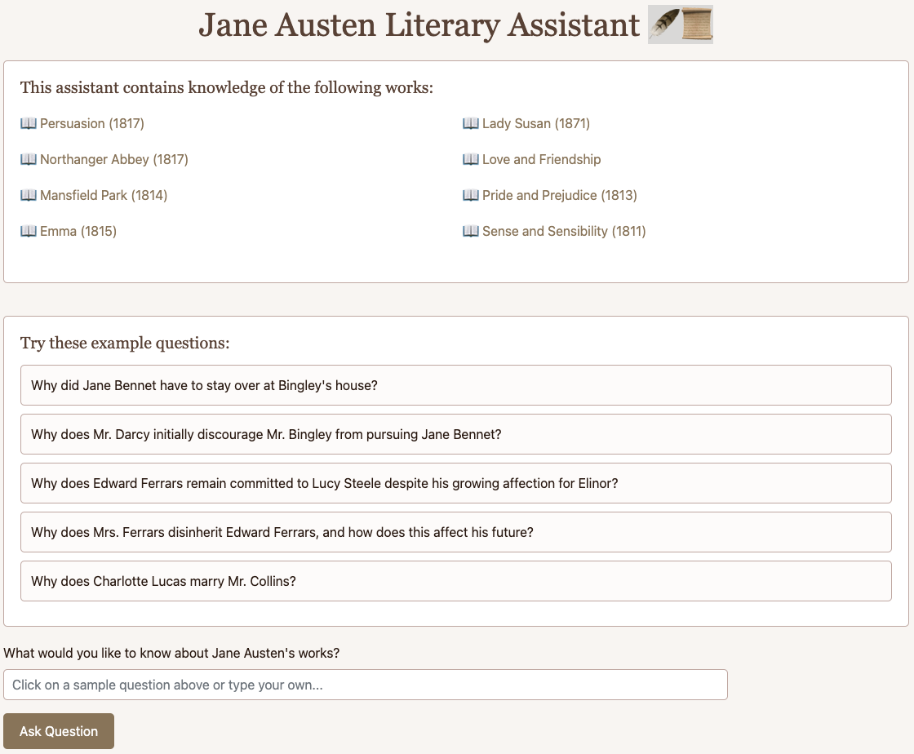

# Overview
The Jane Austen Literary Assistant is an LLM-powered chatbot that uses RAG (Retrieval Augmented Generation) to answer questions about Jane Austen's works. The system processes and understands the complete works of Jane Austen, providing detailed responses to user queries about plots, characters, themes, and literary analysis.

**Live App:** [Jane Austen Literary Assistant](https://jane-austen-literary-assistant.onrender.com/)



# Features
- Interactive question-answering interface
- Pre-loaded demo questions for quick exploration
- Comprehensive coverage of Jane Austen's major works: *Pride and Prejudice* (1813), *Sense and Sensibility* (1811), *Emma* (1815), *Mansfield Park* (1814), *Persuasion* (1817), *Northanger Abbey* (1817), *Lady Susan* (1871), *Love and Friendship*.

# Technical Stack
- **Backend:** Python, Flask
- **Frontend:** HTML, CSS, Bootstrap
- **AI/ML:** LangChain, OpenAI GPT
- **Vector Database:** Chroma
- **Document Processing:** LangChain Text Splitters
- **Containerization:** Docker
- **Deployment:** Render

# Project Structure
```
JaneAustenChatBot/
├── LICENSE
├── README.md
├── data/
│   ├── processed/      # Processed text chunks
│   ├── vector_db/      # Vector embeddings database
│   └── raw/            # Original text files
├── src/
│   ├── __init__.py
│   ├── base.py         # Utility functions
│   ├── data_ingestion.py  # Text processing
│   └── data_preprocessing.py  # Vector database creation
├── templates/
│   └── index.html      # Web interface
├── requirements.txt
├── Dockerfile       
└── app.py            # Main Flask application
```

# Setup and Installation

### 1. Clone the repository:
```
git clone https://github.com/yourusername/JaneAustenChatBot.git
cd JaneAustenChatBot
```

### 2. Create and activate virtual environment:
```
pyenv virtualenv 3.11.0 janeaustenchatbot
pyenv activate janeaustenchatbot
```

### 3. Install dependencies:
```
pip install -r requirements.txt
```

### 4. Set up environment variables:
Create a `.env` file in the root directory:
```
OPENAI_API_KEY=your_api_key_here
LANGCHAIN_API_KEY=your_api_key_here
LANGCHAIN_TRACING_V2=true
```

### 5. Process the text files and create vector database:
```
python src/data_ingestion.py
python src/data_preprocessing.py
```

### 6. Run the application:
```
python app.py
```

# Deployment

### **Using Docker**
Docker ensures that the chatbot runs in a consistent environment across different machines.

1. **Build the Docker image:**
```
docker build -t janeaustenchatbot .
```
2. **Run the container:**
```
docker run -p 5000:5000 --env-file .env janeaustenchatbot
```

### **Deploying on Render**
1. **Create a new web service on Render:**
   - Select the GitHub repository.
   - Choose a runtime (`Python 3.11.0`).
   - Add the necessary environment variables (`OPENAI_API_KEY`, etc.).
2. **Set up a start command:**
```
python app.py
```
3. **Deploy and access the app**

# Acknowledgments
We extend our gratitude to **Project Gutenberg** for providing access to Jane Austen’s literary works. This project is powered by OpenAI’s GPT models, enabling nuanced and context-aware responses. Additionally, the frontend design draws inspiration from Regency-era aesthetics, reflecting the historical charm of Austen’s time.
